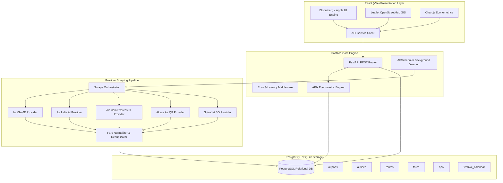

# VAYU-Index Architecture & System Design

**VAYU-Index** is India's Real-Time Airfare Intelligence Platform engineered with:
- **Bloomberg-grade Financial Rigor**: Quantitative index normalization, exponential moving averages, and elasticity curves.
- **FlightRadar24 Situational Awareness**: Real-time geospatial tracking of 36 primary Indian airport hubs and 160+ domestic flight corridors.
- **Apple UI/UX Aesthetics**: Sleek dark mode (`#020817`), custom glassmorphism (`backdrop-blur-xl`), 24px corner radii, and micro-animations.

---

## 1. High-Level System Architecture

---

## 2. APIx (Airfare Price Index) Algorithm

### The Mathematical Model

The APIx score is India's sovereign airfare price index modeled with a **100.0 nominal baseline** against standard statutory cost-per-kilometer tariffs:

1. **Theoretical Benchmark Base Tariff ($B$)**:
   $$\text{Base Tariff } B = \max(2400, d \times 4.20)$$
   where $d$ is the Great-Circle flight distance in kilometers.

2. **Lead Time Weighting ($W$)**:
   Purchasing lead times are divided into 6 distinct purchasing windows:
   - $w_0$ (0–1 day, Last-Minute): weight $0.18$
   - $w_3$ (2–4 days, Near-Term): weight $0.34$
   - $w_7$ (5–7 days, One Week): weight $0.22$
   - $w_{14}$ (8–14 days, Mid-Range): weight $0.16$
   - $w_{30}$ (15–30 days, Sweet Spot): weight $0.07$
   - $w_{60}$ (31–60 days, Early Bird): weight $0.03$

3. **Composite Route Fare ($F_{\text{route}}$)**:
   $$F_{\text{route}} = \frac{\sum_{w} \bar{F}_w \cdot \text{weight}_w}{\sum_w \text{weight}_w}$$

4. **Route APIx Score ($APIx_{\text{route}}$)**:
   $$APIx_{\text{route}} = \left( \frac{F_{\text{route}}}{B} \right) \times 100$$

5. **National APIx ($APIx_{\text{national}}$)**:
   $$APIx_{\text{national}} = \frac{\sum_{r} APIx_r \cdot \text{Weight}_r}{\sum_{r} \text{Weight}_r}$$
   where $\text{Weight}_r$ is the DGCA passenger density weight of sector $r$.

6. **Price Elasticity of Demand ($\varepsilon$)**:
   $$\varepsilon = \frac{\Delta \% \text{Fare}}{\Delta \% \text{Lead Time Days}}$$
   A negative coefficient (typically $-0.45$ to $-0.52$) indicates exponential fare jumps within 7 days of departure.

---

## 3. Scraper Pipeline Architecture

The Playwright provider architecture is organized into strict single-responsibility modules:
- **`scraper/core/rate_limiter.py`**: Token Bucket rate limiter preventing burst penalties.
- **`scraper/core/session_manager.py`**: Rotating simulated device fingerprints and headers.
- **`scraper/core/retry_manager.py`**: Exponential backoff with random jitter.
- **`scraper/normalizers/fare_normalizer.py`**: Standardizes carrier JSON and HTML into unified schema.
- **`scraper/providers/`**: Pluggable provider wrappers for IndiGo, Air India, Air India Express, Akasa Air, and SpiceJet.
- **`scraper/storage/db_storage.py`**: High-performance batch upserting into PostgreSQL.
