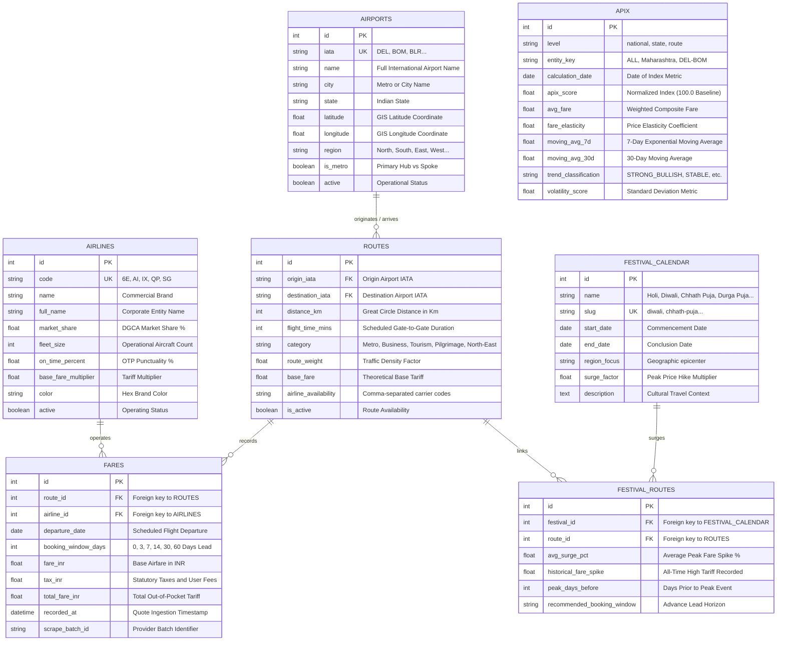

# VAYU-Index Entity Relationship (ER) Diagram

```mermaid
erDiagram
    AIRPORTS ||--o{ ROUTES : "originates / arrives"
    AIRLINES ||--o{ FARES : "operates"
    ROUTES ||--o{ FARES : "records"
    ROUTES ||--o{ FESTIVAL_ROUTES : "links"
    FESTIVAL_CALENDAR ||--o{ FESTIVAL_ROUTES : "surges"

    AIRPORTS {
        int id PK
        string iata UK "DEL, BOM, BLR..."
        string name "Full International Airport Name"
        string city "Metro or City Name"
        string state "Indian State"
        float latitude "GIS Latitude Coordinate"
        float longitude "GIS Longitude Coordinate"
        string region "North, South, East, West..."
        boolean is_metro "Primary Hub vs Spoke"
        boolean active "Operational Status"
    }

    AIRLINES {
        int id PK
        string code UK "6E, AI, IX, QP, SG"
        string name "Commercial Brand"
        string full_name "Corporate Entity Name"
        float market_share "DGCA Market Share %"
        int fleet_size "Operational Aircraft Count"
        float on_time_percent "OTP Punctuality %"
        float base_fare_multiplier "Tariff Multiplier"
        string color "Hex Brand Color"
        boolean active "Operating Status"
    }

    ROUTES {
        int id PK
        string origin_iata FK "Origin Airport IATA"
        string destination_iata FK "Destination Airport IATA"
        int distance_km "Great Circle Distance in Km"
        int flight_time_mins "Scheduled Gate-to-Gate Duration"
        string category "Metro, Business, Tourism, Pilgrimage, North-East"
        float route_weight "Traffic Density Factor"
        float base_fare "Theoretical Base Tariff"
        string airline_availability "Comma-separated carrier codes"
        boolean is_active "Route Availability"
    }

    FARES {
        int id PK
        int route_id FK "Foreign key to ROUTES"
        int airline_id FK "Foreign key to AIRLINES"
        date departure_date "Scheduled Flight Departure"
        int booking_window_days "0, 3, 7, 14, 30, 60 Days Lead"
        float fare_inr "Base Airfare in INR"
        float tax_inr "Statutory Taxes and User Fees"
        float total_fare_inr "Total Out-of-Pocket Tariff"
        datetime recorded_at "Quote Ingestion Timestamp"
        string scrape_batch_id "Provider Batch Identifier"
    }

    APIX {
        int id PK
        string level "national, state, route"
        string entity_key "ALL, Maharashtra, DEL-BOM"
        date calculation_date "Date of Index Metric"
        float apix_score "Normalized Index (100.0 Baseline)"
        float avg_fare "Weighted Composite Fare"
        float fare_elasticity "Price Elasticity Coefficient"
        float moving_avg_7d "7-Day Exponential Moving Average"
        float moving_avg_30d "30-Day Moving Average"
        string trend_classification "STRONG_BULLISH, STABLE, etc."
        float volatility_score "Standard Deviation Metric"
    }

    FESTIVAL_CALENDAR {
        int id PK
        string name "Holi, Diwali, Chhath Puja, Durga Puja..."
        string slug UK "diwali, chhath-puja..."
        date start_date "Commencement Date"
        date end_date "Conclusion Date"
        string region_focus "Geographic epicenter"
        float surge_factor "Peak Price Hike Multiplier"
        text description "Cultural Travel Context"
    }

    FESTIVAL_ROUTES {
        int id PK
        int festival_id FK "Foreign key to FESTIVAL_CALENDAR"
        int route_id FK "Foreign key to ROUTES"
        float avg_surge_pct "Average Peak Fare Spike %"
        float historical_fare_spike "All-Time High Tariff Recorded"
        int peak_days_before "Days Prior to Peak Event"
        string recommended_booking_window "Advance Lead Horizon"
    }
```
